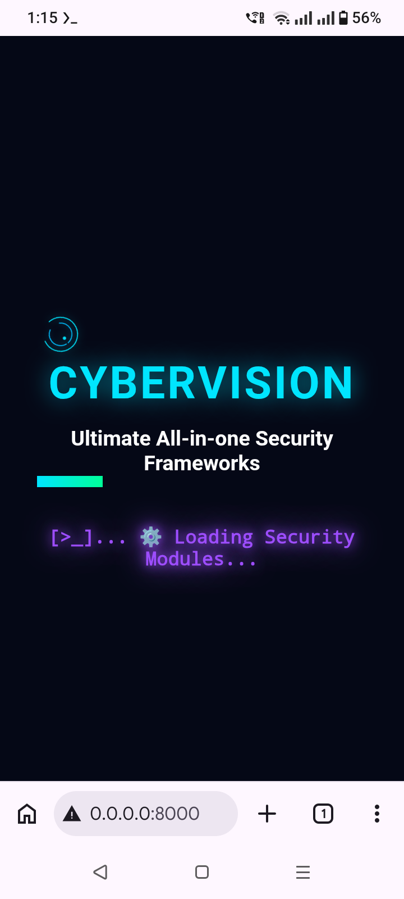
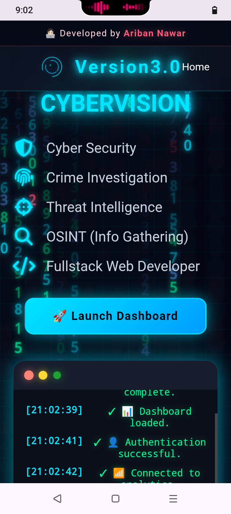
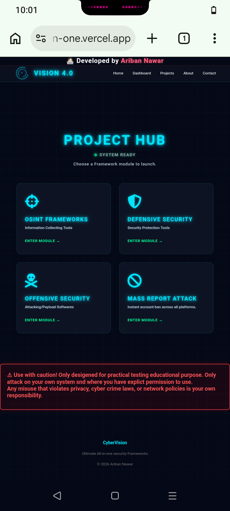
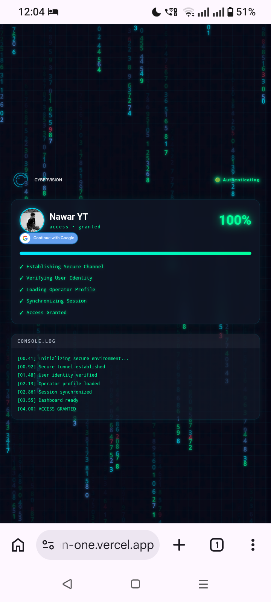

# 🌐 CYBERVISION 
[CYBERVISION](https://cyber-vision-one.vercel.app) is an Ultimate All-in-one Security Framework softwares project stored as a Website. It contains all the security testing toolkits and necessary softwares for both (☠️OFFENSIVE &amp; 🛡️DEFENSIVE).
#
## 📸 Booting Screen

#
# 🎯 Purpose
⚠The main purpose of creating my website is to do Ethically/Legally security testing or attack testing (only on your own account and system network or you have explicit permission to use it!!). 🚀I have divided the 'Project' section of the website into 4 separate tasks - Defensive Security or Security Protecting & Offensive Security or Attacking, OSINT Frameworks or Finding Information about a Person & MASS REPORT attack that simulates profile suspension accorss all the major known social platforms.
#
# 📱 UI Interface specialization
>>Ultimate modern Cyber live Dashboard/Hacker Console UI interface setup designed in multiple bold neonic glowing effects and hover animations with matrix binary codes:

✓ 🌀Spectrum/spectre styled blue circling animations  
✓ 📱Boot loading & Authentication Screen  
✓ 👩🏻‍💻 Developer bar  
✓ 🕔 Digital Time clock  
✓🖥️ Live terminal logs scrolling  
✓📊 Animated charts and statistics  
✓🪞 Glassmorphism cards effect  
✓⚡ Bold Neon blue/green accents/Cyan  
✓📡 Real-time status indicators  
✓📈 Network activity graphs <bf>
✓🔒 Security scanning animations  
✓💻 Console output panels  
✓🌑 Dark themed grid layout with smooth transitions   
✓📟 multi colored Matrix styled Computer binary codes raining animations background of the grid  
✓🔋 shows CPU usage, Network status,Memory, space  
✓ 🌐 Social Media profile links (Contact with me)
#
## 📸 Homepage UI

#
# ⚙️ Features specialization 

📂 Within the entire PROJECT HUB, I have divided the project sections into 4 different tasks - (Defensive or Security Protecting & Offensive or Attacking & OSINT Frameworks or Finding Information about a Person & MASS REPORT or profile suspension simulation):

🔐 Defensive layer - Check suspicious URL link, protect social accounts from attacker using 2FA, protect yourself from being public data breach, Check Malicious APK file. [Coming Soon]

🛡️ Offensive layer - Generate Phising Link, Generate infected APK, Attack Network protocol, Premium master Social Engineering, Crack Wireless password,
Block wifi connection, Hijack Social account, Hijack Banking Financial account, Phish OTP verification code. [Coming Soon]

🔎 OSINT Framework- 

(A) 👤Username search ( search the  user input 'username' across major social platforms- Facebook,Instagram,Twitter/X ,Google,What'sApp, Telegram,YouTube,GitHub,TikTok,LinkedIn) [Coming Soon]

(B)  📞 Phone number search (search for social media profils accosiated or connected with the user input 'phone number'- Facebook,Instagram,Twitter/X ,Google,What'sApp, Telegram,YouTube,GitHub,TikTok,LinkedIn) [Coming Soon]

(C) 📧 Email search" (search for social media profils accosiated or connected with the user input 'email address' - Facebook,Instagram,Twitter/X ,Google,What'sApp, Telegram,YouTube,GitHub,TikTok,LinkedIn) [Coming Soon]
#
## 📸 PROJECT HUB 

#
# 🛡️🌐👤 Web-Security foundation & Enhanced User Privacy Protection 

✓ 𝙂𝙤𝙤𝙜𝙡𝙚-𝙨𝙞𝙜𝙣-𝙞𝙣 𝘼𝙪𝙩𝙝𝙚𝙣𝙩𝙞𝙘𝙖𝙩𝙞𝙤𝙣 𝙛𝙚𝙖𝙩𝙪𝙧𝙚𝙨🪪  ✓ 𝙇𝙞𝙣𝙠𝙚𝙙 𝙩𝙤 𝙂𝙤𝙤𝙜𝙡𝙚 𝘾𝙡𝙤𝙪𝙙 𝙋𝙧𝙤𝙟𝙚𝙘𝙩☁️ 
✓  𝙈𝙤𝙧𝙚 𝙐𝙨𝙚𝙧 𝙥𝙧𝙞𝙫𝙖𝙘𝙮 𝙖𝙙𝙙𝙚𝙙 𝙬𝙞𝙩𝙝 𝙂𝙤𝙤𝙜𝙡𝙚 𝘼𝙪𝙩𝙝𝙚𝙣𝙩𝙞𝙘𝙖𝙩𝙞𝙤𝙣 🔏  
#
## 📸 Authentication 

#
🛡️𝙎𝙚𝙘𝙪𝙧𝙞𝙩𝙮 𝙝𝙚𝙖𝙙𝙚𝙧𝙨 
✅ Content Security Policy (CSP) 
✅ X-Frame-Options 
✅ X-Content-Type-Options 
✅ Referrer-Policy 
✅ Permissions-Policy 
✅ HSTS (for HTTPS) 
✅Anti Clickjacking : Prevent attackers/hackers from embedding CyberVision inside an invisible iframe. 
✅MIME Protection: Prevent browsers from guessing file types. 

🔒 𝗘𝗻𝗰𝗿𝘆𝗽𝘁𝗲𝗱 𝗛𝗧𝗧𝗣𝗦 𝘀𝗲𝗿𝘃𝗶𝗻𝗴 𝗼𝗻𝗹𝘆 
✅Force HTTPS 
✅Automatic redirects 
✅Secured Session cookies 
✅Fixed XSS Risk : Cross-site-scripting vulnerability  

🤖🚫 𝗔𝗻𝘁𝗶-𝗕𝗼𝘁 𝗽𝗿𝗼𝘁𝗲𝗰𝘁𝗶𝗼𝗻 
✅Detect automated Headless browsers 
✅Block suspicious user agents 
✅Browser Fingerprinting 
✅Request Validation 
✅Cloudflare Turnstile (Human verification CAPTHAs) 
✅ Browser Validation  

🚦 𝗧𝗿𝗮𝗳𝗳𝗶𝗰 𝗥𝗲𝗾𝘂𝗲𝘀𝘁 𝗥𝗮𝘁𝗲 𝗹𝗶𝗺𝗶𝘁𝗶𝗻𝗴 
✅Limit repeated requests 
✅Protect login/authentication endpoints 
✅Slow down abusive IPs 
✅Anti-DDoS 
✅Login Protection 
✅Abuse Detection 
✅WAF Firewall Protection  

🖥️ 𝗠𝗼𝗻𝗶𝘁𝗼𝗿𝗶𝗻𝗴 
✅Authentication logs 
✅Security event logs 
✅Failed login tracking 
✅Suspicious activity detection 
